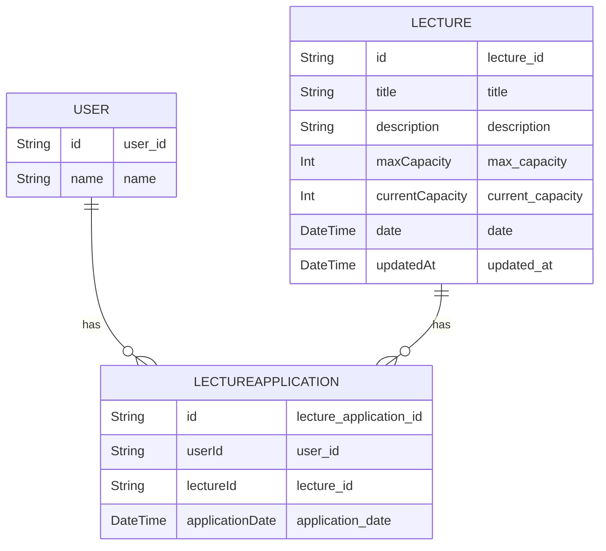
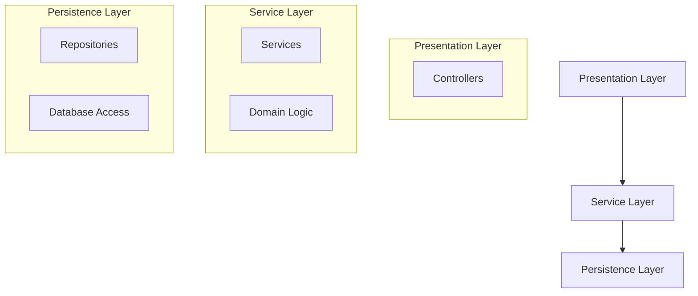
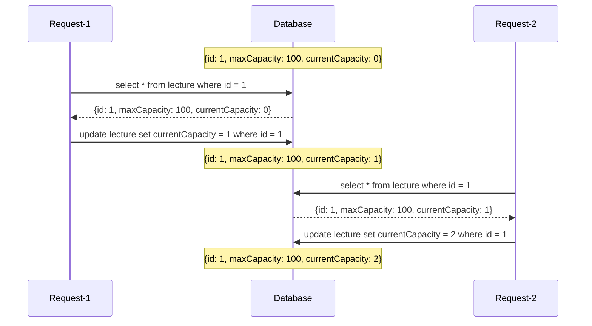
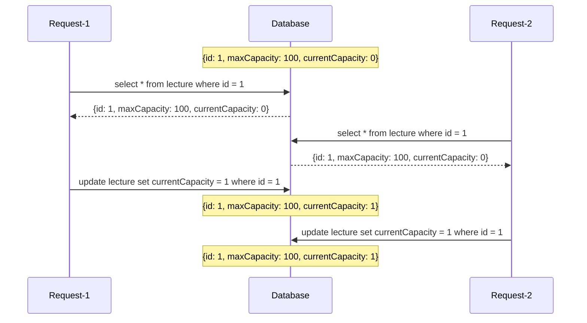
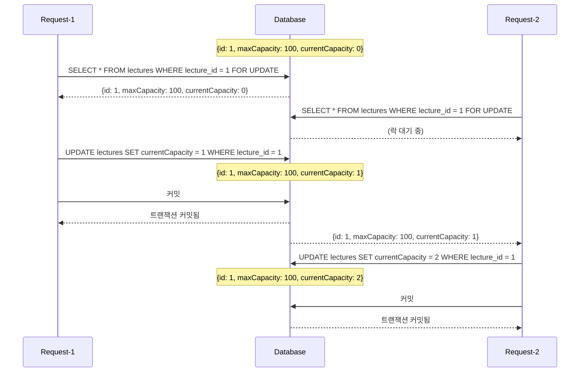

framework: Nestjs
database: mariadb:10.10.2

# 동시성 문제 과제 진행

선착순으로 100명이 특강을 신청했을 때 정상적으로 신청 인원 수가 처리 되도록 구현

### ERD

### 프로젝트 구조

### 예상 실행 순서

### 실제 실행 순서

2명이 동시에 신청 했을 경우 조회 시점이 동일하여 currentCapacity의 값이 2가 되지 못함

## 어떻게 해결하지?

비관 락을 사용하여 해당 문제를 해결

### Lock 이란?

데이터베이스의 일관성과 무결성을 유지하기 위해 여러 트랜잭션이 동시에 동일한 데이터를 접근하거나 수정하는 것을 제어하는 메커니즘

### 비관 락?

비관적 락은 실제로 데이터에 락을 걸어서 정합성을 맞추는 방법. 
Exclusive lock을 걸게 되면 다른 트랜잭션에서는 락이 해제되기 전에 데이터를 가져갈 수 없게 됨. 
그러나 Dead lock이 발생할 수 있는 위험이 있음.

> **Exclusive lock (베타적 잠금)** 
> 쓰기 잠금에 해당, 특정 트랜잭션이 데이터를 변경하려고 할 때, 해당 트랜잭션이 완료될 때까지 다른 트랜잭션이 해당 테이블 또는 행을 읽거나 쓰지 못하게 함

> **Dead lock (교착 상태)** 
> 두 개 이상의 트랜잭션이 서로의 자원을 기다리며 무한 대기 상태에 빠지는 상황

### 비관 락 예시

